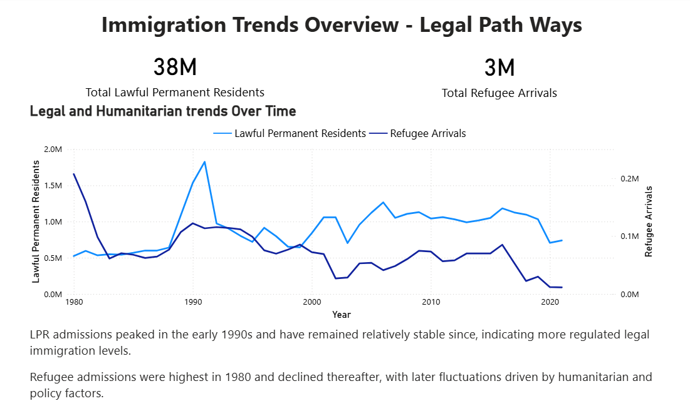
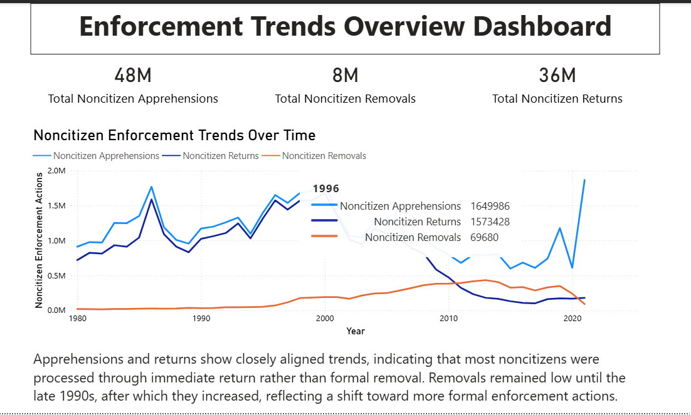

# AWS RDS (MySQL) to Power BI – Immigration Data Analysis

## Project Overview
This project demonstrates how cloud-hosted relational data stored in **AWS RDS (MySQL)** can be directly consumed by **Power BI** for analytics and visualization.

The project focuses on database connectivity, data loading into a managed SQL service, and building dashboards from cloud-based relational data. It represents a realistic Data Analyst workflow involving AWS RDS, MySQL Workbench, and Power BI.

---

## Architecture Overview
**Flow:**

Cleaned Data → AWS RDS (MySQL) → Power BI → Dashboards

- Immigration data was stored in an AWS RDS MySQL database
- Power BI connects directly to the RDS instance using database credentials
- Dashboards are built using live data from the cloud database

---

## Dataset
- **Source:** Public U.S. immigration datasets
- **Data State:** Cleaned and structured
- **Storage:** AWS RDS (MySQL)
- **Table Structure:** Columns match the cleaned dataset used in prior projects

> Raw data preprocessing was performed in a previous AWS S3 + Python pipeline project.

---

## Tools & Technologies
- **AWS RDS (MySQL)**
  - Managed relational database
- **MySQL Workbench**
  - Database connection
  - Database and table creation
  - Data import using Table Data Import Wizard
- **Power BI**
  - Direct connection to MySQL database
  - Interactive dashboards and analysis

---

## Database Setup & Data Loading
- An AWS RDS MySQL instance was created using the AWS Console.
- A database was created manually after instance creation.
- A table was created with schema matching the cleaned immigration dataset.
- Cleaned data was imported into the table using **MySQL Workbench**.
- SQL was used to validate data and support analytics queries.

Detailed SQL workflow documentation is available in the `sql/` folder.

---

## Power BI Integration
- Power BI connects directly to AWS RDS using:
  - RDS endpoint
  - Database name
  - Port
  - Credentials
- Data is queried from MySQL and used to build dashboards analyzing immigration trends and enforcement metrics.

---

## Dashboard Preview

### Immigration Overview (RDS Source)


### Immigration Trends Analysis


---

## Repository Structure
```text
rds-immigration-powerbi-mysql/
│
├── images/
│
├── powerbi/
│   └── rds_immigration_dashboard.pbix
│
├── sql/
│   └── README.md
│
└── README.md
```

Key Learnings
- Hands-on experience with AWS RDS MySQL setup and connectivity
- Practical understanding of relational data loading using MySQL Workbench
- Experience connecting Power BI directly to a cloud-hosted SQL database
- Understanding of cloud-based analytics workflows

Disclaimer
- This project is for educational and portfolio purposes only and does not represent official government analysis or policy recommendations.
